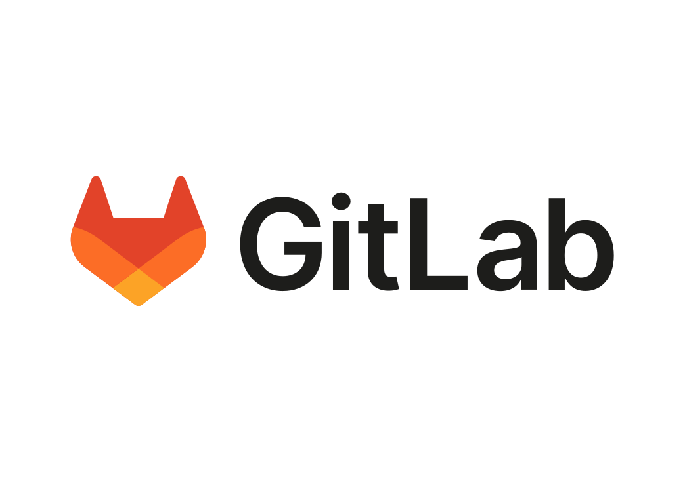
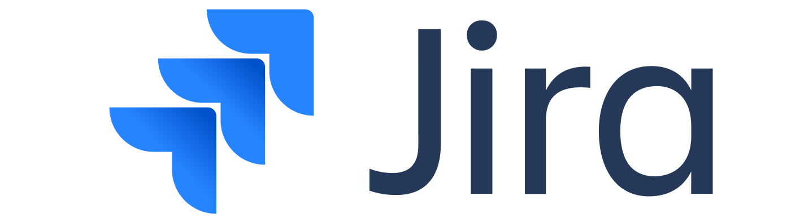

# Hi there! 👋 I'm Sabahat Saeed. 

Welcome to my GitHub profile! I'm passionate about technology and enjoy working with a variety of tools and frameworks. Here's a snapshot of the technologies I frequently use:

## Operating System

- **Linux** 
  - Description: Preferred operating system for development.

## Version Control and CI/CD

- **GitLab** 
  - Description: Version control and CI/CD platform.
- **Jenkins** 
  - Description: Automation server for building, testing, and deploying code.

## Build and Dependency Management

- **Maven** 
  - Description: Build automation and project management tool.

## Containerization and Orchestration

- **Docker** 
  - Description: Containerization platform for packaging, distributing, and running applications.
- **Kubernetes** 
  - Description: Container orchestration for automating deployment, scaling, and management of containerized applications.

## Project Management and Issue Tracking

- **Jira** 
  - Description: Project management and issue tracking tool.

## Cloud Services

- **AWS** 
  - Description: Cloud computing platform offering a wide range of services.
- **Cloud Services** 
  - Description: General reference to cloud services.

## Web and Application Development

- **Laravel** 
  - Description: PHP framework for web application development.
- **Flutter** 
  - Description: UI toolkit for building natively compiled applications for mobile, web, and desktop.
- **Symfony** 
  - Description: PHP web application framework with a set of reusable PHP components.

## DevOps

- **DevOps** 
  - Description: Cultural and professional movement that emphasizes communication and collaboration between software development and IT operations teams.
    
✨ I'm always eager to learn and adapt to new technologies and industry best practices. If you're interested in collaborating or have any questions, feel free to reach out!

📫 You can connect with me on  or 
 . Let's build amazing things together!
