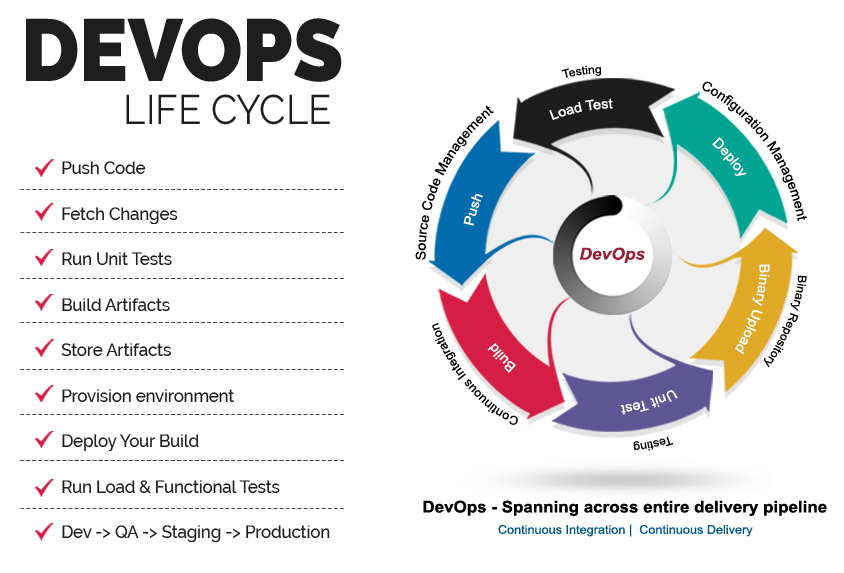

👋 Hello! I'm Sabahat Saeed, an AWS DevOps engineer with 2 years of industry experience. I have a strong background in cloud infrastructure management and automation, ensuring seamless deployment and scalability for web and mobile applications.

💻 Tech Stack:
- AWS: EC2, S3, RDS, Lambda, CloudFormation, CloudWatch, etc.
- Docker, Kubernetes: Containerization and orchestration for scalable deployments.
- PHP: Laravel, CodeIgniter for building robust and efficient web applications.
- MERN Stack: MongoDB, Express.js, React.js, Node.js for full-stack development.
- Flutter: Cross-platform framework for developing mobile applications.

🔧 I'm passionate about building reliable, secure, and high-performance systems. My experience includes:
- Designing and implementing CI/CD pipelines for automated application deployment.
- Managing and optimizing cloud infrastructure to achieve cost efficiency and performance.
- Monitoring and troubleshooting production environments to ensure system stability.
- Collaborating with development teams to enhance application performance and scalability.
- Building RESTful APIs and integrating third-party services for seamless functionality.
- Developing responsive and user-friendly mobile applications using Flutter.

🌟 GitHub Contributions:
- Constantly working on personal projects to explore new technologies and improve my skills.
- Contributing to open-source projects related to AWS, DevOps, and PHP frameworks.
- Sharing code snippets, tutorials, and technical insights on my blog and social media.

✨ I'm always eager to learn and adapt to new technologies and industry best practices. If you're interested in collaborating or have any questions, feel free to reach out!

📫 You can connect with me on  or 
 . Let's build amazing things together!
 
 
  
 
 <picture>
  <source media="(prefers-color-scheme: dark)" srcset="https://user-images.githubusercontent.com/25423296/163456776-7f95b81a-f1ed-45f7-b7ab-8fa810d529fa.png">
  <source media="(prefers-color-scheme: light)" srcset="https://user-images.githubusercontent.com/25423296/163456779-a8556205-d0a5-45e2-ac17-42d089e3c3f8.png">
  
</picture>
 

  
  
  
  
  
  
  
  

